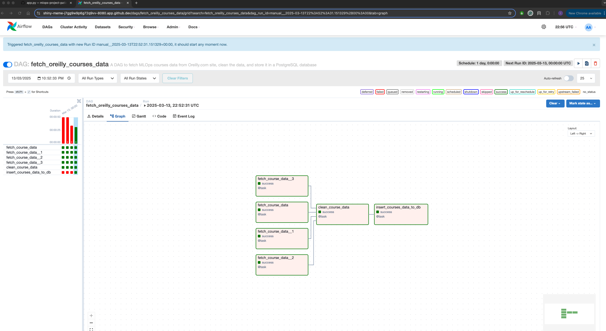
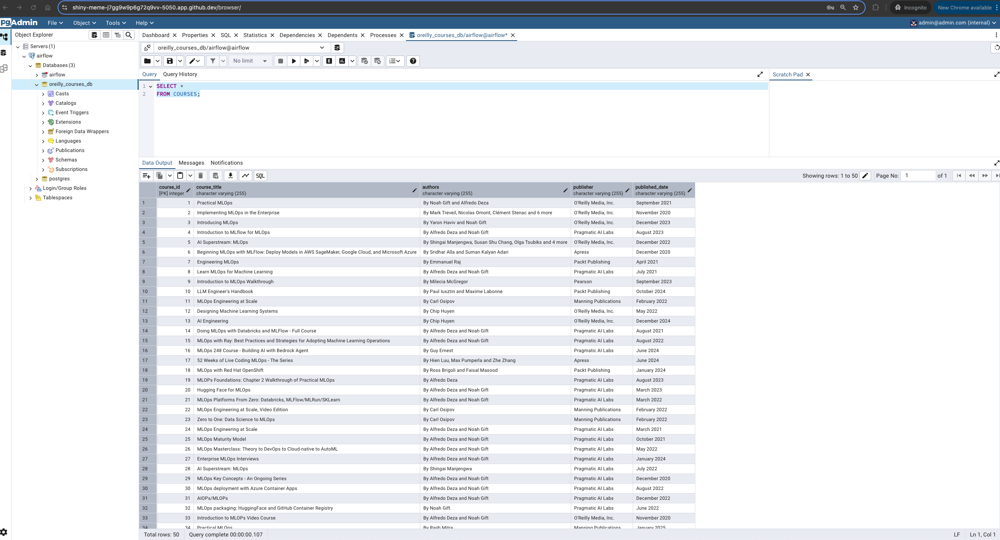

# oreilly-courses-data-pipeline

Extract Oreilly courses data on **MLOps** and load them into a Postgres DB table.

## Tools Used
- **Airflow**: For ETL orchestration
- **Playwright**: For web scraping
- **Postgres**: For database setup
- **Docker**: For packaging and running services

## Setup Instructions

### 1. Install Airflow
Follow the instructions from the official documentation: [How to install Airflow?](https://airflow.apache.org/docs/apache-airflow/stable/howto/docker-compose/index.html)

### 2. Build and Start the services
a) Run the following command to create a docker build:
```sh
docker compose build --no-cache
```
b) Run the following command to start the services:
```sh
docker compose up
```

### 3. Running Services
This command should start the following services:
- postgres
- pgadmin
- redis
- airflow-webserver

Run the command below to inspect the Postgres container and grab the `IPAddress`:
```sh
docker inspect <container-id>
```

### 4. Access Airflow UI
Access the Airflow UI running at `<host-url>:8080`.

Add connections from the connections menu:
- **Login**: Retrieve from `docker-compose.yaml`
- **Password**: Retrieve from `docker-compose.yaml`
- **Port**: Retrieve from `docker-compose.yaml`
- **Host**: Use the `IPAddress` taken in step 3
- **Database Name**: Provide a DB name such as `oreilly_courses_db`

### 5. Setup pgAdmin UI
Access the pgAdmin UI running at `<host-url>:5050`.

Add a new connection:
- **Login**: Retrieve from `docker-compose.yaml`
- **Password**: Retrieve from `docker-compose.yaml`
- **Port**: Retrieve from `docker-compose.yaml`
- **Host Name/Address**: Use the `IPAddress` taken in step 3
- **Database Name**: Use the same DB name as in step 4

### 6. Run the DAG
Run the DAG named `fetch_oreilly_courses_data` in the Airflow UI.

### 7. Verify Data Insertion
Once the DAG run is successful (i.e., all tasks passed)



run a SQL SELECT query to see records inserted into the Postgres DB as below




